# unity-xr-project-hdrp
Generic Unity 3d XR virtual reality project using HDRP, XRI toolkit, OpenXR, Oculus SDK and input system.

## Overview ##

Step by step instructions on how to build the base 3d HDRP repository / project for simple 3d HDRP XR unity projects.. lazy programmers -> clone one of the releases to access this.

when building Vr projects need to change the xr plugin -> android settings for the specific device we are building for. If not OpenXR builds will display in your oculus home room, there we will need independent builds for oculus and friends. This guide will instruct you. and is based off of this project template https://github.com/BatCountryEntertainment/unity-xr-project-3d

This is easy human, very easy. You will be a meta pro in no time using simple guide.

## BUILDING 3D HDRP VR PROJECT WITH MOST RECENT UNITY SETTINGS : PART 1 - SETUP ##

### Step 1 ###

First create a new project in unity 2021.2.10f1 using the `unity-xr-project-3d` repository found here https://github.com/BatCountryEntertainment/unity-xr-project-3d

go to this repo, and clone it into a new project directory onto your computer

easiest way to do this is to use git hub desktop client, and when your browser prompts to open in desktop client select that and choose a location to download to.

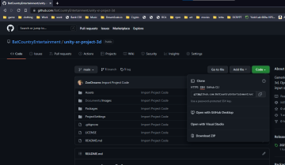

Alternative you can also download the zip of the project and extract that to an existing repo that you might have setup.

Then load the new project directory you extracted into unity hub, and load the project. select `add project from disk`

After it loads open the sample scene

### Step 2 ###

Now that we have our base project setup with 3d we need to upgrade the scene to use HDRP. This will require importing a few packages and upgrading our ground material to an HDRP shader.

you can read more about this on unity docs https://docs.unity3d.com/Packages/com.unity.render-pipelines.high-definition@12.1/manual/VR-Overview.html

Basic summary is that we can use any feature or setting within HDRP however we should configure it as we have to optimize for our xr device. It is also important to note that DX12 features are
currently not supported, so we need to make sure we are using DX11 to develop our APK with.

you can find more information about this upgrade process here https://docs.unity3d.com/Packages/com.unity.render-pipelines.high-definition@12.1/manual/Upgrading-To-HDRP.html

The High Definition Render Pipeline (HDRP) uses a new set of Shaders and lighting units, both of which are incompatible with the Built-in Renderer. To upgrade a Unity Project to HDRP, you must first convert all of your Materials and Shaders, then adjust individual Light settings accordingly.

Open our package manager

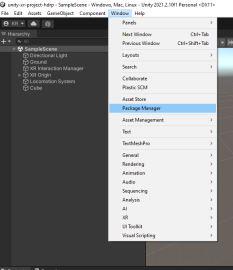

now navigate to the unity registry packages from the drop down in the top left corner. from the list select `High Definition RP` and click install. Be patient this can take a few minutes depending on the speed of your machine.

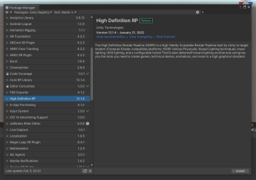

you can close the package manager now. After installing HDRP the wizard for this should be visible. if it isn't you can access it via `window -> rendering -> HDRP Wizard` 

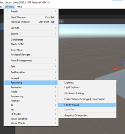

the wizard should look like this

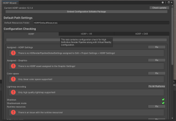

as you can see we have a bunch of errors so click on the `fix all` button at the top under the tabs.. This should help us clear some of these issues up.

The wizard is going ask if you want to create a default profile, click `create one` to generate it. Again this might take a few minutes depending on your machine, so be patient it will finish.

Now the wizard should have a bunch of green checks showing that all of the errors have been fixed.

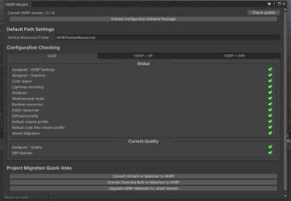

As you can see our ground plane is now magenta to show that the shader is using the legacy built in material. we need to upgrade our project materials to use HDRP. If you see some errors or warnings in the console ignore them as long as the wizard is green checks then everything is okay.

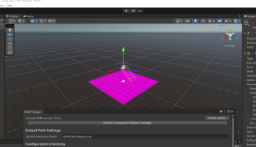

### Step 3 ###

Next we are going to click the `convert all built-in materials to hdrp button` the top one

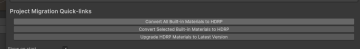

its going to ask you if you made a backup, ignore and just click `Proceed`. we live on the edge. thats why your here? :) For good measure after you convert i usually click on `upgrade HDRP materials to Latest Version` to double check nothing has errrored.

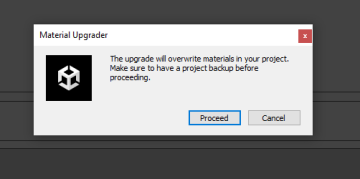

now click on the `HDRP + VR` tab in the wizard. you should also see all green checks. You will see a couple warning that the oculus drive needs ot be manually installed.. we performed this within the `unity-xr-project-3d` walk through guide found that we cloned the project from. yay.

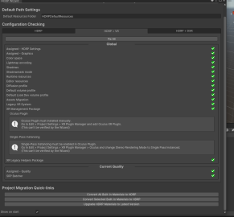

you can also toggle off the show at shart up check box on the bottom of the wizard. now close the wizard

As you can see our grabbable cube is magenta, because it is using the default material. The easiest way to fix this is to make a new material from the `M_Ground` material by copying pasting it within the project tab

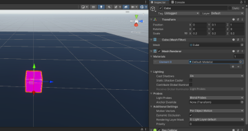

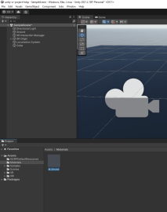

lets name our new material `M_Cube`. Remember that the prefix `M_` is used on all of our materials so that we can easier search for them with `M_*`

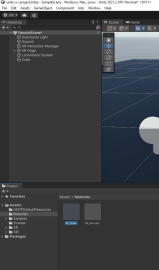

click on the new material you just renamed in the project tab to view it in your inspector tab. now click on the base map setting to open the color picker. lets make it a different color.

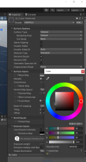

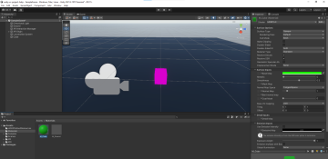

now click and drag the green material onto our magenta cube in the scene view.

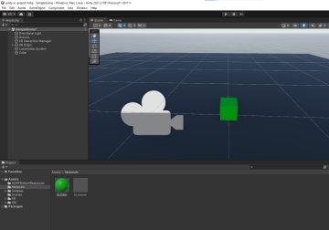